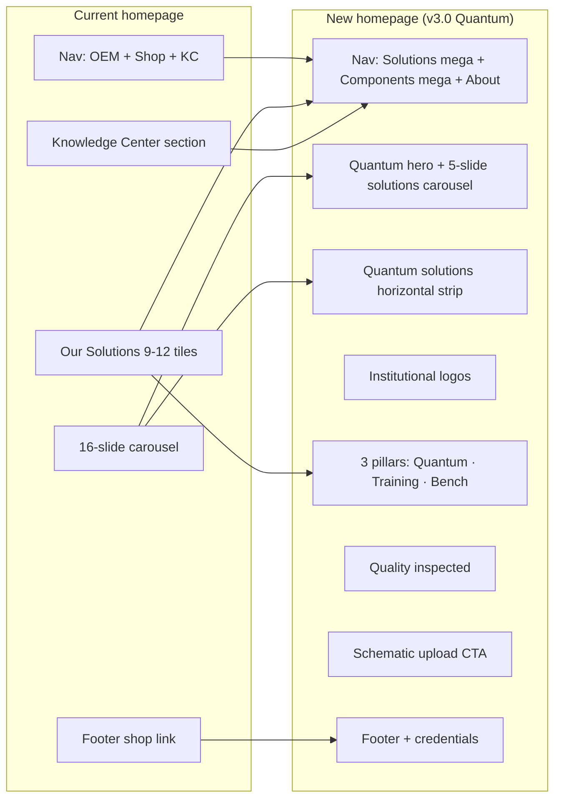

# Homepage Content Mapping — Old sciengtech.in → New Homepage (v3.0 — Quantum)

> **Scope:** Homepage only (`https://sciengtech.in/` → new `/`).  
> **New model:** Quantum-led RFQ B2B. No cart on homepage.  
> **Live reference:** [`index.html`](../index.html)

---

## Part 1 — New homepage: where each block comes from

| # | New homepage element | Source on current homepage | Mapping type |
|---|----------------------|----------------------------|--------------|
| **NAV** |
| 1 | Logo **SciEngTech Solutions** | Same logo / site name in header | **Direct carry-over** |
| 2 | Nav **Solutions** | No top-level item; content spread across “Our Solutions” tiles + `/lasers/`, `/optics/`, `/vacuum/`, etc. | **Consolidated** — new IA bucket for system-level pages |
| 3 | Nav **Components** (mega-menu) | **Our OEM Products** + **Our Products** nav + “Our Solutions” product links + carousel SKU links | **Merged** — two old nav items → one catalog |
| 4 | Mega-menu **01 Lasers & Photonics** | Tiles: Lasers, Laser Metrology, Fiber Optics; carousel: laser-related OEM; `/lasers/`, `/laser-metrology/`, `/fiber-optics/` | **Regrouped** |
| 5 | Mega-menu **02 Precision Optics** | Tile: Optics; `/optics/`, `/our-oem-optics-*`, lens product pages | **Regrouped** |
| 6 | Mega-menu **03 Optomechanics** | Tile: Opto-Mechanics; carousel: Post, Holder, Base, Collars, Fork, Clamps, Lens Mount, Kinematic, Breadboards, Labjacks, Translation Stage; `/our-oem-products-opto-mechanics/` | **Regrouped** |
| 7 | Mega-menu **04 Vacuum & HV** | Tiles: Vacuum Technology (hidden), Electronics & HV (hidden); `/vacuum/`, `/power-supplies-electronics-hardware/` | **Regrouped** + **Surfaces hidden content** |
| 8 | Nav **Utilities** | Tiles: Detectors, Testing Lab (hidden), Water Chillers (hidden), Optical Cleaning; `/detectors/`, `/testing-lab/`, `/water-chillers/`, `/optical-cleaning-accessories/` | **New nav bucket** for secondary categories |
| 9 | Nav **About** | **About Us** nav + footer contact block + part of **Contact Us** | **Expanded** mega with Company + Engineering Hub |
| 10 | **RFQ Portal** button | No equivalent; closest = **Contact Us** + generic inquiry | **New** — primary conversion |
| 11 | ~~Search~~ | Header search widget | **Removed** from homepage (→ global search later) |
| 12 | ~~Cart / Login~~ | Header cart + “Login/Register” | **Removed** — WooCommerce decommissioned |
| **HERO** |
| 13 | Overline “Deep-Tech Hardware Infrastructure” | No equivalent | **New copy** (strategy positioning) |
| 14 | H1 “Precision Hardware for Advanced Science and Engineering.” | Old `<title>`: “Specialists in Lasers and Optics” + hidden intro paragraph (“Industry level experts…”) | **Rewritten** from brand promise, not copied |
| 15 | Subhead (certified optics, optomechanics, diagnostics, vacuum…) | Hidden intro: “Lasers and Optics… Optical Imaging, Vacuum Technology, Detectors, Clean Room Accessories…” | **Synthesized** from old intro + solution tile list |
| 16 | CTA **Request Technical Quote** | No homepage CTA; footer **Contact Us** | **New** primary action |
| 17 | CTA **Browse Components** | **Our Products** nav + “Products” footer link → `/shop/` | **Repurposed** — shop → catalog browse (no cart) |
| 18 | Hero visual / spec hint | 16-slide **carousel** images (opto-mechanics, hardware, etc.) | **Replaced** — one static hero instead of 16 rotating slides |
| **INSTITUTIONAL PROOF** |
| 19 | “Powering research across India's leading defense, space, and academic labs.” | Not on homepage (aspirational; About mentions institutes generally) | **New** — needs logo permissions |
| 20 | Grayscale logo row | Not on homepage | **New** |
| **THREE-PILLAR MATRIX** |
| 21 | H2 “Engineered for flawless replication…” | H2 **Our Solutions** (different message) | **New copy**; section replaces old grid heading |
| 22 | Pillar **01 Optics & Laser Diagnostics** | Tiles: **Optics**, **Lasers**, **Laser Metrology**, **Detectors** (partial) | **Merged** 3–4 tiles → 1 pillar |
| 23 | Pillar **02 Optomechanics & Hardware** | Tiles: **Opto-Mechanics**, **Hardware & Tools** + carousel mechanical OEM | **Merged** |
| 24 | Pillar **03 Vacuum & HV Power Supplies** | Tiles: **Vacuum Technology** (hidden), **Electronics & HV** (hidden caption) | **Merged** + **Un-hidden** |
| 25 | Link “View System Specs” | Each old tile linked to category/OEM URL directly | **Same intent**, new labels & targets under `/components/` |
| 26 | ~~Training Kits tile~~ | Visible in old “Our Solutions” grid | **Not on new homepage body** → Solutions mega + `/solutions/quantum-optical-research/` |
| 27 | ~~Fiber Optics tile~~ | Visible on old homepage | **Not on homepage pillar** → Components mega → Fiber Optics |
| 28 | ~~Optical Cleaning tile~~ | Visible on old homepage | **Moved** → Utilities (not homepage pillar) |
| **DEEP DATA PROOF** |
| 29 | “Rigorous compliance. Guaranteed field performance.” | Not on homepage | **New** (B2B trust framing) |
| 30 | “100% Quality Inspected” | About page: “committed to ensuring the highest product quality” | **Elevated** from About → homepage metric (needs ops sign-off) |
| 31 | Spec table preview (λ/10, HR @ 800 nm…) | Not on homepage; exists on product/OEM pages | **New UI pattern** sampled from catalog spec content |
| **CLOSING CTA** |
| 32 | “Ready to configure your system requirements?” | Not on homepage | **New** |
| 33 | Upload `.dxf` / `.step` / `.pdf` | Not on homepage | **New** — Engineering Hub |
| 34 | **Upload Tech Specs & Connect** | No equivalent | **New** → `/engineering/upload/` |
| 35 | **Contact System Engineer** | **Contact Us** nav + footer contact | **Repurposed** — engineering-led wording |
| **KNOWLEDGE** |
| 36 | ~~Browse Our Knowledge Center~~ | H2 section + links to `/category/lasers/`, `/category/lenses/` | **Removed from homepage** → About mega → Knowledge Center |
| **FOOTER** |
| 37 | Engineering links (RFQ, Upload, Knowledge) | Footer **Quick Links** partial | **Regrouped** |
| 38 | Catalog links | Footer “Products” → shop | **Repurposed** → Components / Solutions |
| 39 | Credentials (GST, GeM, coordinates) | Footer address + emails only | **Expanded** from footer contact block |
| 40 | ~~Facebook / Instagram as text rows~~ | Footer icon list | **Optional** — can retain in footer, not in prototype |
| 41 | Legal links | Footer **Other Links** | **Direct carry-over** → `/company/legal/` |
| 42 | ~~“Developed by Imaginate Solutions”~~ | Footer credit | **TBD** — keep or remove per stakeholder |

### New homepage summary

| Mapping type | Count (approx.) |
|--------------|-----------------|
| Direct carry-over | ~5 |
| Regrouped / merged from old tiles & nav | ~15 |
| Repurposed (shop→catalog, contact→RFQ) | ~5 |
| Surfaces previously hidden content | ~4 |
| New (no old homepage equivalent) | ~12 |
| Removed from homepage (relocated elsewhere) | ~8 |

---

## Part 2 — Old homepage: where everything goes in the new site

### A. Header & utilities

| Old homepage element | New location | Notes |
|---------------------|--------------|-------|
| **Home** (nav) | `/` | Same |
| **Our OEM Products** (nav) | `/components/` + OEM pages under component tree | Nav item removed; content merged |
| **Our Products** (nav) → `/shop/` | `/components/` | Shop decommissioned; SKUs become spec pages |
| **About Us** (nav) | `/company/about/` + **About** mega-menu | |
| **Knowledge Center** (nav) | `/engineering/knowledge/` | Under Engineering Hub in **About** mega |
| **Contact Us** (nav) | `/company/contact/` + RFQ CTAs on homepage | Split: credentials vs quote |
| **Search** | Global search (Phase 1) — not on homepage v1 | |
| **Cart** | Removed | Redirect → `/engineering/rfq/` |
| **Login/Register** | Removed v1; optional institutional portal Phase 2 | |
| **RFQ Portal** | N/A — | **New** header CTA |

### B. Hidden intro block (currently `elementor-hidden` on all devices)

| Old content | New location |
|-------------|--------------|
| “Industry level experts and specialists in Lasers and Optics…” | **Rewritten** into hero subhead + About page mission |
| “Vaccum Technology, Detectors, Clean Room Accessories…” | Distributed across **Components** mega + **Utilities** |
| “Browse through our wide range of services below” | Retired — replaced by pillar + mega-menu |

### C. Hero carousel (16 slides)

| Old slide | Old URL (pattern) | New location |
|-----------|-------------------|--------------|
| Opto Mechanics | `/our-oem-products-opto-mechanics/` | `/components/optomechanics/` |
| Hardware and Tools | `/product-category/hardware-and-tools/` | `/components/optomechanics/posts-rails-hardware/` or hardware cat |
| Optical Cleaning Accessories | `/optical-cleaning-accessories/` | `/utilities/cleanroom-cleaning/` |
| Training Kit | `/our-oem-products-training-kits/` | `/solutions/[slug].html` (8 individual pages) |
| Optics | `/optics/` | `/components/precision-optics/` |
| Optical Post | `/our-oem-products-optomechanics-posts/` | `/components/optomechanics/posts-rails-hardware/` |
| Post Holder | `/our-oem-products-optomechanics-post-holder/` | Same subtree |
| Post Base | `/our-oem-products-optomechanics-post-base/` | Same subtree |
| Collars | `/our-oem-products-optomechanics-collars/` | Same subtree |
| Pedestal Fork | `/our-oem-products-optomechanics-pedestal-fork/` | Same subtree |
| Angle Clamps | `/our-oem-products-angle-clamps/` | Same subtree |
| Lens Mount | `/our-oem-products-lens-mount/` | `/components/optomechanics/kinematic-mounts/` |
| Kinematic Mounts | `/our-oem-products-kinematic-mount/` | Same |
| Breadboards | `/our-oem-products-breadboards/` | `/components/optomechanics/breadboards-tables/` |
| Labjacks | `/our-oem-products-labjacks/` | `/components/optomechanics/` (lab infrastructure) |
| 25mm Translation Stage | `/our-oem-products-traslation%20stages/` | `/components/optomechanics/translation-stages/` |
| **Carousel UI itself** | Homepage hero | **Removed** — no auto-rotating slides on new homepage |

### D. “Our Solutions” grid (H2 section)

| Old tile | Visible on old HP? | New homepage | If not on HP, new site path |
|----------|-------------------|--------------|----------------------------|
| Opto-Mechanics | Yes | Pillar **02** + Components mega | `/components/optomechanics/` |
| Hardware & Tools | Yes | Pillar **02** (absorbed) | `/components/optomechanics/posts-rails-hardware/` |
| Optical Cleaning Accessories | Yes | Not on HP body | `/utilities/cleanroom-cleaning/` |
| Training Kits | Yes | Pillar **02** + Solutions strip + carousel | `/solutions/training-kits.html` + individual pages |
| Optics | Yes | Pillar **01** | `/components/precision-optics/` |
| Lasers | Yes | Pillar **01** | `/components/lasers-photonics/` |
| Detectors | Yes | Not on HP body | `/utilities/detectors-sensors/` |
| Laser Metrology | Yes | Pillar **01** (absorbed) | `/components/lasers-photonics/metrology-diagnostics/` |
| Fiber Optics | Yes | Not on HP body | `/components/lasers-photonics/fiber-optics-patchcords/` |
| Vacuum Technology | **Hidden** | Pillar **03** (now visible) | `/components/vacuum-hv/` |
| Testing Lab | **Hidden** | Not on HP body | `/utilities/testing-calibration/` |
| Water Chillers | **Hidden** | Not on HP body | `/utilities/thermal-management/` |
| Electronics & HV Power Supplies | **Hidden** (caption on image) | Pillar **03** | `/components/vacuum-hv/power-supplies/` |

### E. “Browse Our Knowledge Center”

| Old element | New location |
|-------------|--------------|
| Section heading | Removed from homepage |
| Link `/category/lasers/` | `/engineering/knowledge/` (+ fix or retire broken category) |
| Link `/category/lenses/` | `/engineering/knowledge/` + lens guides |

### F. Footer

| Old footer item | New location |
|-----------------|--------------|
| Contact emails & Pune address | `/company/contact/` + **About** mega HQ panel + footer |
| Facebook / Instagram | Footer social (optional) |
| Contact Us | `/company/contact/` |
| Terms & Conditions | `/company/legal/terms/` |
| Privacy Policy | `/company/legal/privacy/` |
| Refunds & Returns | `/company/legal/refunds/` |
| Quick: Home | `/` |
| Quick: About | `/company/about/` |
| Quick: Knowledge Center | `/engineering/knowledge/` |
| Quick: Products → shop | `/components/` |
| Imaginate credit | Footer (stakeholder decision) |

### G. Page meta (not visible on page but part of “home”)

| Old | New |
|-----|-----|
| Title: “Specialists in Lasers and Optics” | “Precision Hardware for Advanced Science and Engineering” |
| Meta description (lasers/optics specialist) | RFQ + defense/space/lab keywords (per copy framework) |

---

## Visual: old homepage → new homepage flow

---

## Gaps to resolve before build

1. **Training Kits** — visible on old HP but not on new HP body; confirm prominence (Utilities vs Solutions vs homepage 4th pillar).  
2. **Institutional logos** — new section; permissions required or omit.  
3. **“100% Quality Inspected”** — new claim; ops/legal approval.  
4. **`/category/lasers/`** — broken on old site; don’t migrate; use knowledge hub.  
5. **13 `elementor-hidden` blocks** — Vacuum, Testing Lab, Chillers, HV on old HP; new design intentionally surfaces some via pillars/utilities.  
6. **Search & cart users** — expect redirects and RFQ messaging.

---

*Related: [02-homepage-copy-framework.md](./02-homepage-copy-framework.md) · [04-information-architecture-ux-copy.md](./04-information-architecture-ux-copy.md)*
